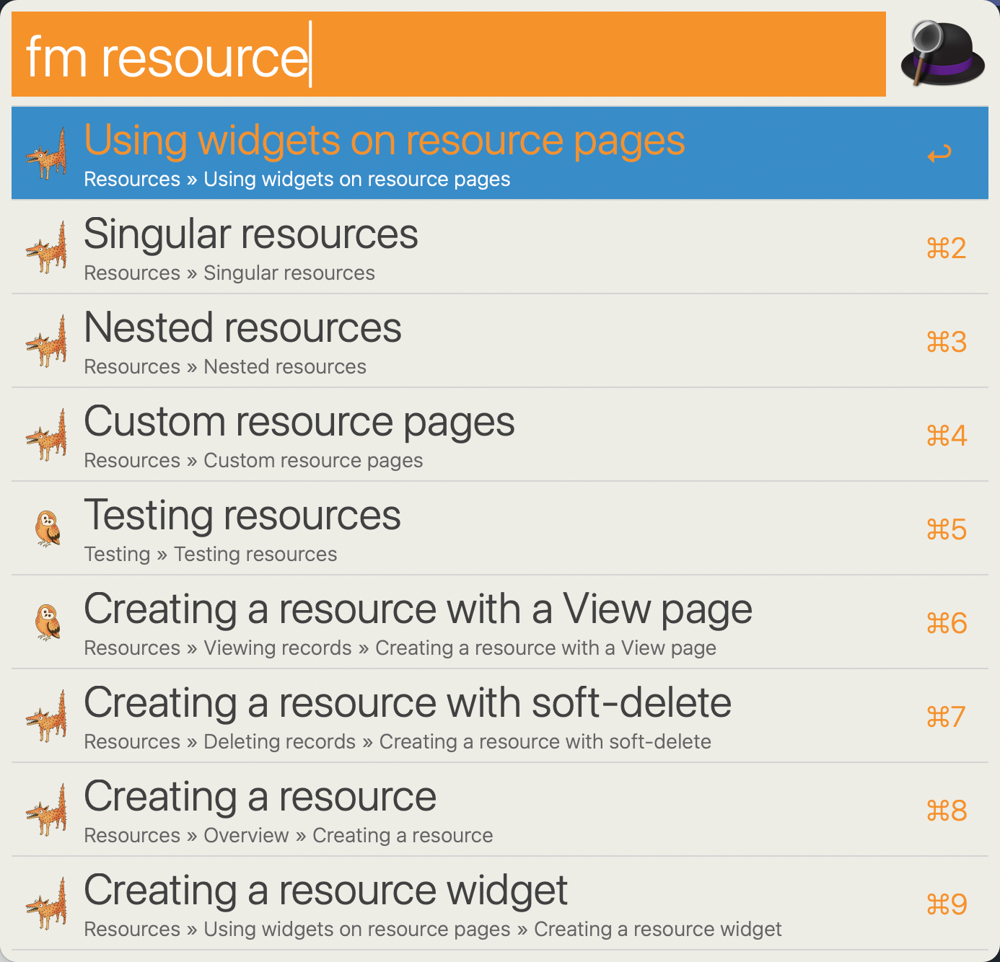

# Filament Docs Workflow for Alfred

An ultra-fast Filament docs search workflow for Alfred 4

Adapted from [Alfred TailwindCSS Docs](https://github.com/clnt/alfred-tailwindcss-docs), which is adopted from [Alfred VueJS Docs](https://github.com/vmitchell85/alfred-vuejs-docs), which is adapted from [Alfred Laravel Docs](https://github.com/tillkruss/alfred-laravel-docs), Thanks [Till Krüss](https://twitter.com/tillkruss)!



## Installation


> **macOS Monterey:** PHP is no longer shipped with macOS, before attempting to use this workflow ensure you have installed the php binary via Homebrew.

1. [Download the latest version](https://github.com/intrepidws/alfred-filament-docs/releases/download/v2.0.0/Filament.Docs.alfredworkflow)
2. Install the workflow by double-clicking the `.alfredworkflow` file
3. You can add the workflow to a category, then click "Import" to finish importing. You'll now see the workflow listed in the left sidebar of your Workflows preferences pane.

## Usage

To search the [3.x docs](https://filamentphp.com/docs/3.x/panels/installation), just type `fm` (or `fm3`) followed by your search query.

```
fm3 <query>
```

To search the [2.x docs](https://filamentphp.com/docs/2.x/admin/installation), just type `fm2` followed by your search query.

```
fm2 <query>
```

To search the [1.x docs](https://filamentphp.com/docs/1.x/admin/getting-started), just type `fm1` followed by your search query.

```
fm1 <query>
```

Either press `⌘Y` to Quick Look the result, or press `<enter>` to open it in your web browser.


